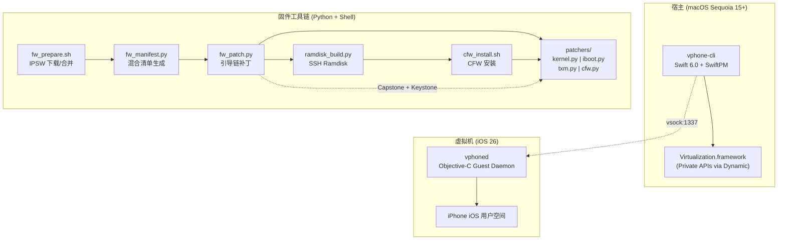
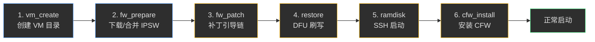
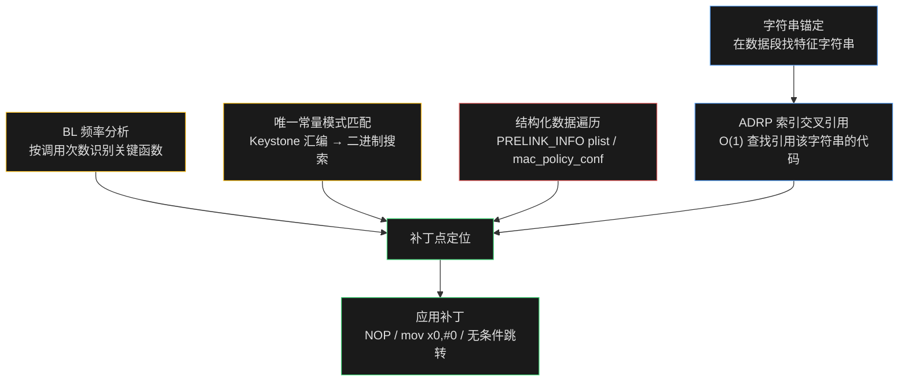
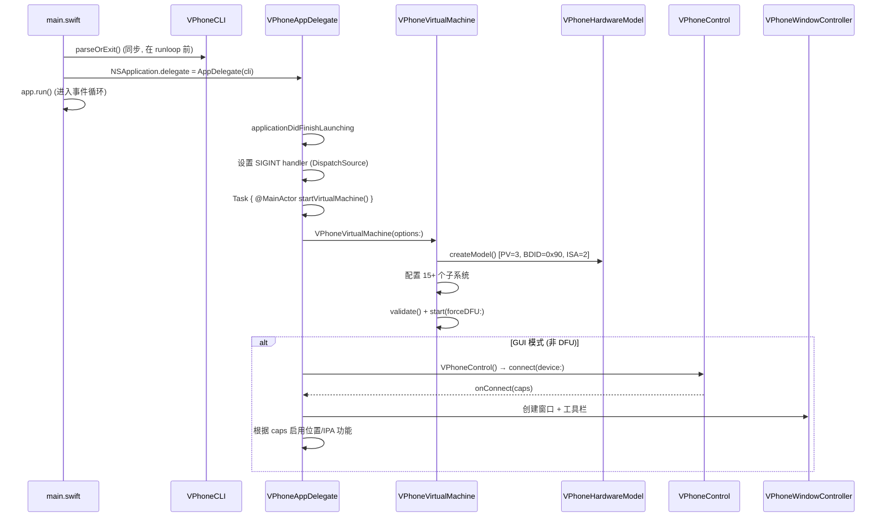
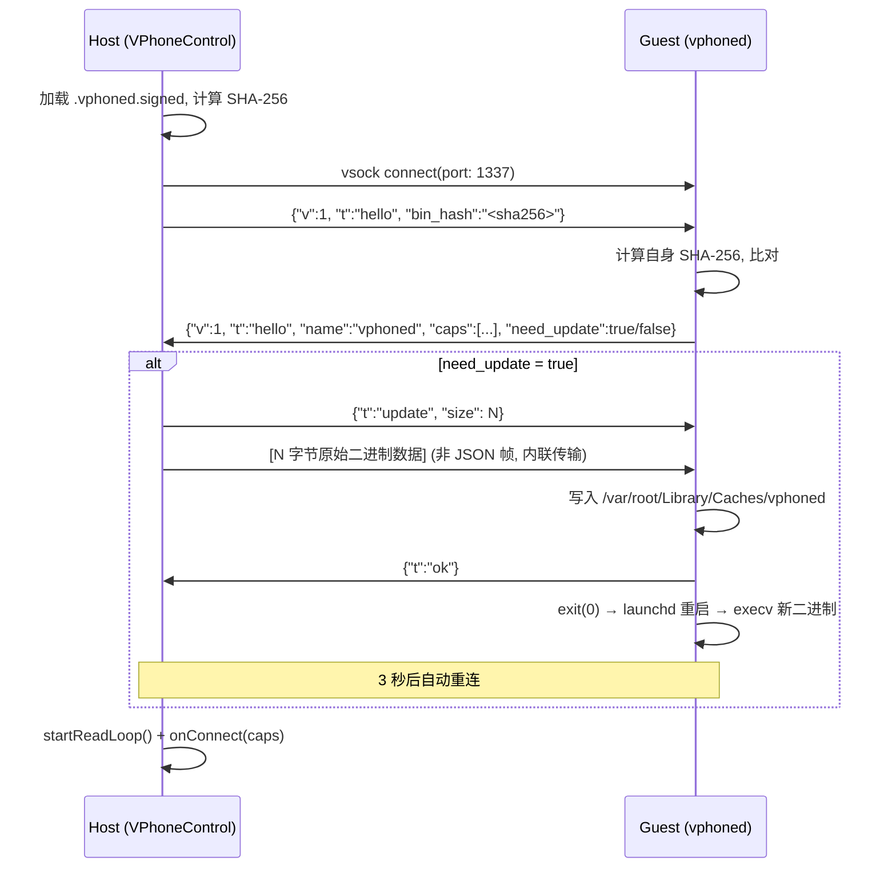
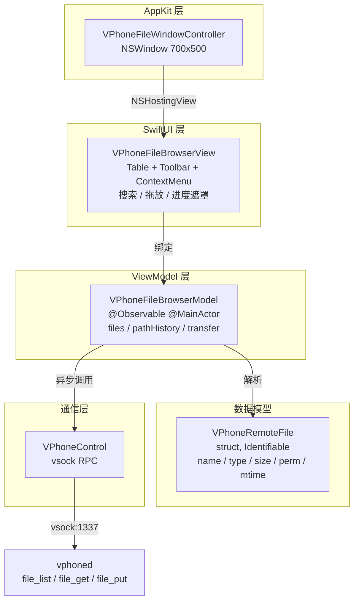
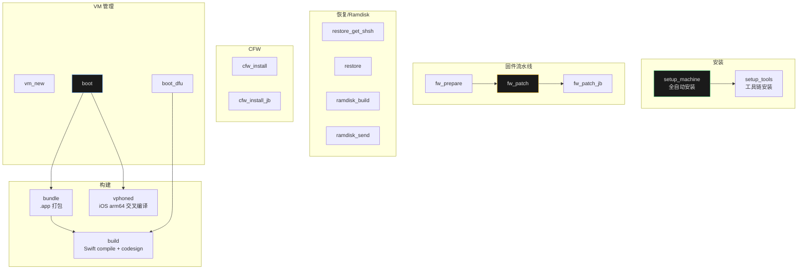

# vphone-cli 技术架构深度分析

> 基于 `install_ipa` 分支的完整源码分析。vphone-cli 是一个通过 Apple Virtualization.framework 引导虚拟 iPhone (iOS 26) 的研究工具，利用 PCC (Private Cloud Compute) 研究虚拟机基础设施实现完整的 iOS 虚拟化。

---

## 目录

0. [项目起源与技术演进](#0-项目起源与技术演进)
1. [系统全景](#1-系统全景)
2. [固件组装流水线](#2-固件组装流水线)
3. [混合身份签名架构](#3-混合身份签名架构)
4. [动态二进制补丁系统](#4-动态二进制补丁系统)
5. [Metal GPU 加速——核心技术突破](#5-metal-gpu-加速核心技术突破)
6. [Swift 虚拟机运行时](#6-swift-虚拟机运行时)
7. [Host-Guest 控制协议](#7-host-guest-控制协议)
8. [Guest Daemon 架构](#8-guest-daemon-架构)
9. [GUI 与交互系统](#9-gui-与交互系统)
10. [构建系统](#10-构建系统)
11. [技术风险与未来挑战](#11-技术风险与未来挑战)

---

## 术语与核心概念

本文档涉及大量 iOS 安全研究领域的专有术语，此处集中解释以便理解后续章节：

| 术语 | 全称 | 说明 |
|------|------|------|
| **SHSH Blob** | Signature HaSH Blob | Apple 设备固件恢复时的**签名票据**。每次通过 DFU/Recovery 模式恢复固件时，设备会向 Apple 的 TSS (Ticket Signing Server) 发送请求，TSS 返回一个包含 APNonce、ECID 等设备唯一标识的签名数据包——即 SHSH blob。它证明"Apple 允许该设备安装此版本固件"。在本项目中，`restore_get_shsh` 阶段获取该票据，从中提取 IM4M (IMG4 Manifest) 签名清单，用于对补丁后的引导链组件重新签名，使 Secure Boot 链信任我们修改过的 iBSS/iBEC/内核等。 |
| **CFW** | Custom FirmWare | **定制固件**。泛指对 Apple 原始固件进行修改后的版本。在本项目中特指通过 `cfw_install.sh` 安装到虚拟 iPhone 上的一系列用户空间补丁集合，包括：Cryptex 文件系统注入、设备激活锁绕过（`mobileactivationd`）、launchd 缓存验证禁用、SEP 工具修补（`seputil`）、GPU 驱动注入、SSH 守护进程部署等。CFW 安装分 7 个阶段，通过 SSH Ramdisk 在恢复完成后写入根文件系统。 |
| **IPSW** | iPhone Software | Apple 设备的**固件包格式**（实为 ZIP 压缩包），包含引导链、内核、根文件系统、Cryptex 分区等全部组件。本项目需要两个 IPSW：iPhone IPSW（提供 iOS 用户空间）和 cloudOS IPSW（提供 PCC 虚拟机引导链与内核）。 |
| **DFU** | Device Firmware Upgrade | 设备固件升级模式。iOS 设备的最底层恢复模式，在此模式下设备仅运行 BootROM 代码，等待 USB 传输固件。本项目通过 Virtualization.framework 的 `_setForceDFU` 私有 API 使虚拟机直接进入 DFU 模式。 |
| **IM4P / IM4M / IMG4** | Image4 格式族 | Apple 的固件镜像签名格式。**IM4P** (Image4 Payload) 是载荷容器；**IM4M** (Image4 Manifest) 是签名清单，从 SHSH blob 中提取；**IMG4** 是最终的签名镜像，= IM4P + IM4M。引导链中的每个组件（iBSS、iBEC、内核等）都以 IMG4 格式存储。 |
| **Cryptex** | Cryptographic Extension | iOS 16+ 引入的**加密扩展分区机制**。将系统库（`dyld_shared_cache`、`libSystem.B.dylib` 等）和应用运行时从主系统分区中分离出来，独立签名和更新。分为 SystemOS Cryptex（系统库）和 AppOS Cryptex（应用运行时）。使用 AEA (Authenticated Encryption Archive) 格式加密。 |
| **Ramdisk** | RAM Disk | 完全运行在内存中的临时文件系统。本项目构建一个注入了 SSH 工具的 Ramdisk，在恢复完成后通过 DFU 引导启动，提供 SSH 访问以手动修补根文件系统（安装 Cryptex、注入驱动、部署 daemon 等）。 |
| **MACF** | Mandatory Access Control Framework | macOS/iOS 内核的**强制访问控制框架**，Sandbox、AMFI 等安全策略都注册为 MACF 策略模块。内核补丁中需要绕过多个 MACF 钩子以禁用沙盒限制。 |
| **AMFI** | Apple Mobile File Integrity | Apple 的**文件完整性验证守护进程**，负责验证 Mach-O 二进制的代码签名和 entitlement。需要在宿主 macOS 上禁用 AMFI 才能运行携带私有 entitlement 的 vphone-cli。 |
| **SIP** | System Integrity Protection | macOS 的**系统完整性保护**机制。需要禁用以允许加载私有 entitlement 和访问受保护的 Virtualization.framework 私有 API。 |
| **Entitlement** | — | Apple 平台的**权限声明**，嵌入在二进制签名中的 plist 键值对。本项目需要 `com.apple.private.virtualization` 等私有 entitlement，正常情况下仅 Apple 自身二进制持有。 |
| **Trust Cache** | — | iOS 的**静态信任缓存**，包含被系统信任的 Mach-O 文件的 CDHash 列表。通过 SSH Ramdisk 注入的二进制（如 `vphoned`、`dropbear`）需要生成对应的 trust cache 才能在 AMFI 启用的 Guest 中执行。 |

---

## 0. 项目起源与技术演进

### 0.1 发现：PCC 固件中的 vphone600ap 组件

2024 年底，Apple 推出 [Private Cloud Compute](https://security.apple.com/blog/private-cloud-compute/)，宣称开辟云端 AI 隐私新纪元。2025 年底，安全研究社区注意到一个异常信号：Apple 在 cloudOS 26 的 PCC 固件中新增了 **vphone600ap** 相关组件——包括专用内核缓存 `kernelcache.research.vphone600`、设备树 `DeviceTree.vphone600ap.im4p` 等。

这些组件的名称强烈暗示 **"iPhone Research Environment Virtual Machine"**。这是 Apple 计划为安全研究者构建的虚拟 iPhone 环境，还是一次意外泄露？考虑到 2021 年 iOS 15.0 beta 至 15.1 beta3 OTA 中曾包含 DEVELOPMENT/KASAN 内核（持续约 4 个月），意外泄露的可能性不能排除。

2026 年 1 月，@_inside 在 Twitter 发布了利用这些 vphone600ap 组件启动虚拟 iPhone 的演示。相比此前的 [QEMUAppleSilicon (Inferno)](https://github.com/ChefKissInc/Inferno) 项目，该方案运行流畅且支持 Metal 加速。这直接催生了本项目的开发（2026 年 1 月 31 日启动）。

### 0.2 技术传承谱系

本项目并非从零构建，而是站在三个关键前序项目的基础之上：

```
┌─────────────────────────────────────────────────────────────────────┐
│                        技术传承链                                     │
│                                                                      │
│  security-pcc (Apple 官方)                                           │
│  └── /System/Library/SecurityResearch/usr/bin/vrevm 源码             │
│      发现: PV=3, BDID=0x90, ISA=2 硬件模型参数                       │
│      发现: AVPBooter/AVPSEPBooter ROM 路径                           │
│      发现: 1290x2796 分辨率 (iPhone 14 Pro Max/15 Plus/15 Pro Max)   │
│                             │                                        │
│                             ▼                                        │
│  super-tart (JJTech0130)                                             │
│  └── tart macOS VM 的扩展版: 自定义 ROM, 串口, DFU, GDB             │
│      提供了 Virtualization.framework 私有 API 的 Swift 封装           │
│                             │                                        │
│                             ▼                                        │
│  vma2pwn (nick-botticelli)                                           │
│  └── macOS 12.0.1 虚拟机引导链完整修改                                │
│      提供了固件补丁 + DFU 恢复 + idevicerestore 的完整工作流          │
│      prepare.sh: IM4P 提取 → RAW 补丁 → IM4P 重建                   │
│      vma2pwn.sh: DFU 模式 → idevicerestore 恢复                     │
│                             │                                        │
│                             ▼                                        │
│  vphone-cli (本项目)                                                 │
│  └── 三者融合 + 核心创新:                                             │
│      ① 混合固件 (iPhone iOS 用户空间 + cloudOS 引导链)                │
│      ② 动态补丁 (零硬编码偏移, 取代 vma2pwn 的静态地址)              │
│      ③ Metal GPU 加速 (AppleParavirtGPU 驱动移植)                    │
│      ④ vsock 控制协议 + Guest Daemon 架构                            │
└─────────────────────────────────────────────────────────────────────┘
```

### 0.3 从硬编码到动态发现——关键架构演进

早期原型（super-tart-vphone writeup 阶段）使用**硬编码文件偏移**进行补丁，例如：

```python
# 早期方式: 硬编码偏移 (仅适用于特定固件版本 26.1/23B85)
patch(0x9D10, 0xd503201f)   # iBSS: nop
patch(0x9D14, 0xd2800000)   # iBSS: mov x0, #0
patch(0x2476964, 0xd503201f)  # kernel: 根快照检查 NOP
patch(0x23cfde4, 0xd503201f)  # kernel: 密封完整性 NOP
```

vphone-cli 将此演进为**零硬编码偏移**的动态分析系统：通过字符串锚定、ADRP 交叉引用索引、BL 频率分析等技术自动定位补丁点，确保跨固件版本兼容。这是整个项目最重要的工程化改进之一。

### 0.4 libirecovery 适配

标准 libimobiledevice 工具链不识别 vresearch101ap 硬件模型。项目需要修改 [libirecovery](https://github.com/wh1te4ever/libirecovery) 以添加 vresearch101ap 的设备描述符，使 `idevicerestore` 能够正确匹配恢复身份并完成 DFU 固件刷写。这是一个容易被忽视但不可或缺的前置步骤。

---

## 1. 系统全景

### 1.1 核心思想

将 **iPhone iOS IPSW**（完整用户空间）与 **cloudOS IPSW**（PCC 引导链 + 内核）合并为混合固件，对引导链施加动态二进制补丁绕过签名验证，使其在 macOS Virtualization.framework 的 `vresearch1` 虚拟硬件上启动完整的 iPhone iOS。

### 1.2 端到端数据流

```
┌─────────────────────────────────────────────────────────────────────┐
│                        IPSW 来源                                    │
│   iPhone IPSW (iOS 26.1)    cloudOS IPSW (PCC vresearch101ap)      │
│   ├── iOS 用户空间           ├── 引导链 (LLB/iBSS/iBEC/SPTM/TXM)   │
│   ├── Cryptex SystemOS/AppOS ├── 内核缓存 (vphone600)               │
│   └── 静态信任缓存           └── 设备树/SEP/GPU/ANE 固件             │
└──────────────┬──────────────────────────┬──────────────────────────┘
               │ fw_prepare.sh           │
               ▼                          ▼
┌─────────────────────────────────────────────────────────────────────┐
│                     合并工作目录                                      │
│   iPhone*_Restore/                                                  │
│   ├── kernelcache.*            ← 来自 cloudOS                       │
│   ├── Firmware/{all_flash,dfu,agx,ane,pmp}/*  ← 来自 cloudOS       │
│   ├── 058-*-*.dmg + 058-*-*.trustcache       ← 保留 iPhone 的      │
│   └── BuildManifest-iPhone.plist             ← 备份原始清单          │
└──────────────────────────┬──────────────────────────────────────────┘
                           │ fw_manifest.py
                           ▼
┌─────────────────────────────────────────────────────────────────────┐
│   混合 BuildManifest.plist + Restore.plist                          │
│   单一 DFU Erase Install 身份 (20 个组件)                            │
│   跨 vresearch101ap / vphone600ap / iPhone 三个来源嫁接              │
└──────────────────────────┬──────────────────────────────────────────┘
                           │ fw_patch.py
                           ▼
┌─────────────────────────────────────────────────────────────────────┐
│   补丁后固件 (6 组件, 41+ 处修改)                                    │
│   AVPBooter(1) + iBSS(2) + iBEC(3) + LLB(6) + TXM(1) + Kernel(25) │
└──────────────────────────┬──────────────────────────────────────────┘
                           │
          ┌────────────────┼────────────────┐
          ▼                ▼                ▼
    restore (DFU)    ramdisk_build     vm_create
          │           ramdisk_send         │
          │                │               │
          └───────┬────────┘               │
                  ▼                        │
           cfw_install.sh                  │
           (7 阶段 SSH 安装)               │
                  │                        │
                  └────────┬───────────────┘
                           ▼
                     make boot
                  ┌─────────────┐
                  │  vphone-cli  │ ← Swift 6.0 + Virtualization.framework
                  │  PV=3 虚拟机  │
                  │  vsock 控制   │ ⟷ vphoned (Guest Daemon)
                  └─────────────┘
```

### 1.3 技术栈总览



---

## 2. 固件组装流水线

### 2.1 六阶段流水线



### 2.2 VM 目录结构 (`vm_create.sh`)

```
vm/
├── AVPBooter.vresearch1.bin       ← 从 Virtualization.framework 资源复制
├── AVPSEPBooter.vresearch1.bin    ← 同上
├── Disk.img                       ← 64 GB 稀疏镜像 (dd seek, APFS COW)
├── SEPStorage                     ← 512 KB 全零, 模拟 SEP 安全存储
├── machineIdentifier              ← 首次启动时创建, 持久化 ECID
├── nvram.bin                      ← 每次启动覆盖
└── .vphoned.signed                ← Guest daemon 签名二进制
```

### 2.3 IPSW 合并策略 (`fw_prepare.sh`)

```
iPhone IPSW                          cloudOS IPSW
┌────────────────┐                  ┌────────────────┐
│ iOS 系统镜像    │                  │ 引导链          │
│ Cryptex DMGs   │                  │  LLB/iBSS/iBEC │
│ Trust Caches   │ ◄─── 保留 ─────  │  SPTM/TXM/SEP  │
│ BuildManifest  │  (备份为 -iPhone) │ 内核缓存        │
│                │                  │ 设备树/GPU/ANE  │
└───────┬────────┘                  └───────┬────────┘
        │                                   │
        └──────────────┬────────────────────┘
                       ▼
              合并后的 Restore 目录
              (cloudOS 引导链覆盖 iPhone 对应位置)
              使用 cp -cR (APFS clone, 零拷贝)
```

### 2.4 Ramdisk 构建 (`ramdisk_build.py`)

8 步签名流水线，处理 iBSS → iBEC → SPTM → DeviceTree → SEP → TXM → Kernel → Ramdisk+Trustcache：

```
SHSH Blob ─→ 提取 IM4M (签名清单)
                │
                ├─→ iBSS: 已补丁 IM4P → 用 IM4M 签名为 IMG4
                ├─→ iBEC: 替换 boot-args (rd=md0) → 签名
                ├─→ SPTM: 仅签名
                ├─→ DeviceTree: 重标记为 rdtr → 签名
                ├─→ SEP: 重标记为 rsep → 签名
                ├─→ TXM release: 重新补丁(restore用) → lzfse 压缩 → 保留 PAYP → 签名
                ├─→ Kernel: 重标记为 rkrn → 保留 PAYP → 签名
                └─→ Ramdisk:
                     原始 cloudOS ramdisk DMG
                           ↓ 扩展为 254 MB APFS
                           ↓ 注入 SSH 工具 (ssh.tar.gz)
                           ↓ ldid 重签所有 Mach-O (signcert.p12)
                           ↓ trustcache 生成信任缓存
                           ↓ 签名
```

> **PAYP 保留技术**：某些 IM4P 文件尾部附带 PAYP (payload properties)。通过 `rfind(b"PAYP")` 定位，追加到新 IM4P 末尾并修正 ASN.1 长度字段。

### 2.5 Cryptex 恢复失败——SSH Ramdisk 方案的根本原因

固件恢复（`idevicerestore`）完成后，虚拟机会自动重启，但此时会在 launchd 进程中发生 panic：因为 `/usr/lib/libSystem.B.dylib` 缺失。该库位于 Cryptex 分区的 dyld_shared_cache 中，而 **Cryptex 分区在恢复过程中未能正确写入**。

这是因为混合固件的 Cryptex DMG 来自 iPhone IPSW，但恢复流程本身由 cloudOS 的引导链驱动。cloudOS 的恢复逻辑与 iPhone Cryptex 的 AEA (Authenticated Encryption Archive) 格式之间存在不兼容，导致 Cryptex 数据无法在恢复阶段被正确安装。

解决方案是引入 **SSH Ramdisk** 作为中间步骤：在恢复完成后、首次正常启动前，通过 SSH Ramdisk 启动虚拟机，手动执行以下操作：

```
恢复后问题诊断:
  idevicerestore 完成 → 重启 → launchd panic
  原因: /usr/lib/libSystem.B.dylib 缺失
       ← dyld_shared_cache 不存在
       ← Cryptex 分区未正确恢复
       ← cloudOS 恢复逻辑不兼容 iPhone AEA Cryptex

SSH Ramdisk 修复流程:
  1. APFS 快照重命名 (com.apple.os.update-* → orig-fs)
     → 允许后续修改根文件系统
  2. AEA 解密 iPhone SystemOS Cryptex → 挂载 → SCP 传输到 /mnt1/System/Cryptexes/OS
  3. 复制 iPhone AppOS Cryptex → /mnt1/System/Cryptexes/App
  4. 创建 dyld 符号链接:
     /System/Library/Caches/com.apple.dyld → ../../../System/Cryptexes/OS/...
     /System/DriverKit/System/Library/dyld → ../../../../System/Cryptexes/OS/...
```

这个问题直接解释了为什么整个流水线必须包含 ramdisk_build → ramdisk_send → cfw_install 三个额外阶段，而不能像标准 iOS 恢复那样一步到位。

### 2.6 CFW 安装 (`cfw_install.sh`)

通过 SSH ramdisk 写入设备文件系统，7 个阶段（幂等设计，可安全重跑）：

```
                        SSH Ramdisk 运行中 (端口 2222)
                                   │
    ┌──────────────────────────────┼──────────────────────────────┐
    │                              ▼                              │
    │  ┌─────────────────────────────────────────────────────┐   │
    │  │ 1/7  Cryptex 安装                                    │   │
    │  │   解析 iPhone BuildManifest → AEA 解密 SystemOS      │   │
    │  │   → 复制 SystemOS + AppOS 到 /mnt1/System/Cryptexes │   │
    │  │   → 创建 dyld 符号链接                               │   │
    │  └─────────────────────────────────────────────────────┘   │
    │  ┌─────────────────────────────────────────────────────┐   │
    │  │ 2/7  seputil 补丁                                    │   │
    │  │   "/%s.gl" → "/AA.gl" (Gigalocker UUID 固定化)       │   │
    │  └─────────────────────────────────────────────────────┘   │
    │  ┌─────────────────────────────────────────────────────┐   │
    │  │ 3/7  GPU 驱动安装                                    │   │
    │  │   AppleParavirtGPUMetalIOGPUFamily.bundle            │   │
    │  └─────────────────────────────────────────────────────┘   │
    │  ┌─────────────────────────────────────────────────────┐   │
    │  │ 4/7  iosbinpack64 安装 (越狱工具包)                  │   │
    │  └─────────────────────────────────────────────────────┘   │
    │  ┌─────────────────────────────────────────────────────┐   │
    │  │ 5/7  launchd_cache_loader 补丁                       │   │
    │  │   NOP 条件分支 → 允许加载修改后的 launchd.plist       │   │
    │  └─────────────────────────────────────────────────────┘   │
    │  ┌─────────────────────────────────────────────────────┐   │
    │  │ 6/7  mobileactivationd 补丁                          │   │
    │  │   should_hactivate → 返回 YES (绕过激活锁)           │   │
    │  └─────────────────────────────────────────────────────┘   │
    │  ┌─────────────────────────────────────────────────────┐   │
    │  │ 7/7  LaunchDaemons 安装                              │   │
    │  │   编译 vphoned → 安装到 /usr/bin/                    │   │
    │  │   注入 bash/dropbear/trollvnc/vphoned plist          │   │
    │  │   补丁 launchd.plist                                 │   │
    │  └─────────────────────────────────────────────────────┘   │
    │                                                             │
    │  APFS 快照管理: com.apple.os.update-* → orig-fs            │
    │  所有补丁从 .bak 备份重新应用 (幂等)                         │
    └─────────────────────────────────────────────────────────────┘
```

---

## 3. 混合身份签名架构

### 3.1 问题

DFU 硬件报告为 `vresearch101ap` (BDID=0x90, ChipID=0xFE01)，但需要运行 iPhone iOS 用户空间。Apple 的签名验证要求 BuildManifest 中的身份与硬件完全匹配。

### 3.2 三源嫁接方案

`fw_manifest.py` 生成的 BuildManifest 从三个不同身份中精选组件：

```
┌─────────────────────────────────────────────────────────────────┐
│              混合 Build Identity (单一 DFU Erase Install)        │
│                                                                  │
│  ┌──── vresearch101ap RELEASE ────┐  ┌── vresearch101ap RESEARCH ──┐
│  │  LLB          (匹配 DFU 硬件)  │  │  iBoot/TXM (宽松限制)       │
│  │  iBSS/iBEC    (DFU 签名)       │  │  KernelCache (research内核) │
│  │  SPTM         (安全监视器)      │  └────────────────────────────┘
│  │  RestoreRamDisk (cloudOS 恢复)  │
│  └────────────────────────────────┘
│                                                                  │
│  ┌──── vphone600ap RELEASE ────────┐  ┌──── iPhone ERASE ──────────┐
│  │  DeviceTree   (MKB dt=1,       │  │  OS (iOS 系统镜像)          │
│  │               无 keybag 启动)   │  │  SystemVolume               │
│  │  SEP Firmware (匹配设备树)      │  │  StaticTrustCache           │
│  └────────────────────────────────┘  │  SystemVolumeCanonicalMetadata│
│                                       └────────────────────────────┘
└─────────────────────────────────────────────────────────────────┘
```

### 3.3 Restore.plist 设备映射

`DeviceMap` 同时包含 iPhone 和 cloudOS 的设备条目，`SupportedProductTypeIDs` 合并两个来源的 DFU/Recovery ID，确保 `idevicerestore` 能匹配到正确的恢复身份。

选择逻辑：`Info.Variant` 部分匹配 `"Erase Install (IPSW)"` 同时排除 `"Research"`。

---

## 4. 动态二进制补丁系统

### 4.1 核心设计哲学

**零硬编码偏移** —— 所有补丁通过动态分析定位，确保跨固件版本兼容：



### 4.2 KernelPatcher 预处理架构

`patchers/kernel.py` 在应用任何补丁前构建三个全局索引，使后续查找达到 O(1) 或 O(n) 线性复杂度：

```
┌───────────────────────────────────────────────────────────────┐
│                    预处理阶段 (一次性)                          │
│                                                               │
│  1. Mach-O 段解析                                             │
│     解析 __TEXT, __TEXT_EXEC, __PRELINK_TEXT 等段              │
│     确定 BASE_VA (0xFFFFFE0007004000) 和代码范围              │
│                                                               │
│  2. Kext 范围发现                                              │
│     解析 __PRELINK_INFO (XML plist)                           │
│     提取 APFS / Sandbox / AMFI 三个 kext 的                  │
│     _PrelinkExecutableLoadAddr → 嵌入 Mach-O → __text 范围   │
│                                                               │
│  3. ADRP 页索引  [page_addr → [(file_offset, dest_reg)]]     │
│     遍历所有可执行段的每条 ADRP 指令                           │
│     解码目标页地址 → 建立倒排索引                              │
│     效果: 给定字符串 VA → O(1) 找到所有 ADRP 引用             │
│                                                               │
│  4. BL 调用索引  [target_offset → [caller_offsets]]           │
│     遍历所有 BL 指令 → 解码跳转目标                           │
│     建立 callee → callers 的倒排索引                          │
│     效果: O(1) 查询任意函数的调用者数量                        │
│                                                               │
│  5. _panic 发现                                               │
│     条件: callers > 2000 且前方 ADRP+ADD 指向 "@%s:%d"        │
│     用于后续定位 panic 相关分支                                │
└───────────────────────────────────────────────────────────────┘
```

### 4.3 引导链补丁总览 (fw_patch.py, 6 组件 41+ 处)

```
┌──────────┬────────┬─────────────────────────────────────────────────────┐
│ 组件      │ 补丁数 │ 关键技术                                             │
├──────────┼────────┼─────────────────────────────────────────────────────┤
│ AVPBooter │   1    │ 0x4447 ("DG") 常量锚定 → 返回值改 mov x0,#0        │
│ iBSS     │   2    │ 串口 banner 替换 + Image4 回调 b.ne NOP             │
│ iBEC     │   3    │ 串口 + Image4 绕过 + boot-args ADRP 重编码          │
│ LLB      │   6    │ 串口 + Image4 + boot-args + rootfs(3处) + panic     │
│ TXM      │   1    │ 0x2446 常量锚定 → 二叉搜索 BL → mov x0,#0          │
│ Kernel   │  25    │ (见下方详细分类)                                      │
└──────────┴────────┴─────────────────────────────────────────────────────┘
```

### 4.4 内核 25 处补丁分类

```
┌──────────────────────────────────────────────────────────────────────┐
│                          内核补丁 (25 处)                            │
│                                                                      │
│  ┌─ APFS 文件系统 (5 处) ─────────────────────────────────────────┐ │
│  │  #1  根快照检查 NOP       (tbnz w8,#5 → NOP)                  │ │
│  │  #2  密封完整性 panic 跳过 (BL _panic 前条件分支 NOP)           │ │
│  │  #3  rootvp 认证 panic 跳过                                    │ │
│  │  #12 apfs_graft 根哈希验证 → mov w0,#0                        │ │
│  │  #13-14 rw 挂载 + 升级检查 (cmp x0,x0 / mov w0,#0)           │ │
│  └────────────────────────────────────────────────────────────────┘ │
│                                                                      │
│  ┌─ 代码签名/启动约束 (5 处) ────────────────────────────────────┐  │
│  │  #4-5  proc_check_launch_constraints → mov w0,#0; ret         │ │
│  │  #8    TXM CodeSignature 后验证 tbnz NOP                      │ │
│  │  #9    AMFI postValidation → cmp w0,w0 (始终通过)             │ │
│  │  #15   fsioc_graft Image4 验证 → mov w0,#0                   │ │
│  └────────────────────────────────────────────────────────────────┘ │
│                                                                      │
│  ┌─ 安全策略 (4 处) ─────────────────────────────────────────────┐  │
│  │  #6-7  PE_i_can_has_debugger → mov x0,#1; ret (启用调试器)    │ │
│  │  #10-11 dyld_policy_internal → mov w0,#1 (允许任意 dyld)     │ │
│  └────────────────────────────────────────────────────────────────┘ │
│                                                                      │
│  ┌─ Sandbox MACF 钩子 (10 处, 5 个 hook × 2 条指令) ────────────┐  │
│  │  #16-25 通过 mac_policy_conf 结构发现:                         │ │
│  │    "Sandbox" + "Seatbelt sandbox policy" 字符串               │ │
│  │    → __DATA_CONST chained fixup pointer                       │ │
│  │    → ops 表 → 函数指针 → mov x0,#0; ret                      │ │
│  │                                                                │ │
│  │  禁用的 hook:                                                  │ │
│  │    vnode_check_open / vnode_check_rename                      │ │
│  │    mount_check_mount / mount_check_remount                    │ │
│  │    vnode_check_access                                         │ │
│  └────────────────────────────────────────────────────────────────┘ │
└──────────────────────────────────────────────────────────────────────┘
```

### 4.5 IBootPatcher 通用模式 (iBSS/iBEC/LLB 共享)

```
                    iBSS        iBEC        LLB
串口 banner 替换     ✓           ✓           ✓
Image4 回调绕过      ✓           ✓           ✓
自定义 boot-args               ✓           ✓
rootfs 绕过 (6处)                           ✓
Panic 绕过                                  ✓
```

Image4 回调绕过的通用模式：
```
搜索模式:  b.ne <target>; mov x0, x22   (且前方有 cmp 指令)
补丁:      NOP b.ne + 置返回值为 0
```

### 4.6 CFW 用户空间补丁 (`patchers/cfw.py`)

```
┌─────────────────────────────────────────────────────────────────┐
│  7 个 CLI 子命令                                                 │
│                                                                  │
│  cryptex-paths        解析 BuildManifest → Cryptex DMG 路径      │
│  patch-seputil        "/%s.gl" → "/AA.gl" (Gigalocker 固定化)   │
│  patch-launchd-cache  字符串锚 → ADRP xref → NOP 条件分支       │
│  patch-mobileactivationd  符号表/ObjC 元数据 → mov x0,#1; ret   │
│  patch-launchd-jetsam 字符串锚 → 条件分支 → 无条件跳转          │
│  inject-daemons       plistlib 注入 LaunchDaemon 条目            │
│  inject-dylib         Mach-O LC_LOAD_DYLIB 注入 (FAT 感知)      │
└─────────────────────────────────────────────────────────────────┘

mobileactivationd 补丁的双重回退策略:

    策略 1: LC_SYMTAB 符号查找
    ─────────────────────────
    搜索 "should_hactivate" → 符号 VA → 文件偏移

    策略 2: ObjC 元数据链 (符号表不可用时)
    ─────────────────────────────────────
    "should_hactivate\0" 选择器字符串
        → __objc_selrefs 指针
            → __objc_const 相对方法列表
                → 计算 IMP 偏移
```

---

## 5. Metal GPU 加速——核心技术突破

### 5.1 问题发现

固件恢复 + Cryptex 安装完成后的首次启动中，虚拟 iPhone 停留在黑色设置屏幕，无法继续（respring 循环）。通过 MetalTest 程序验证，`MTLCreateSystemDefaultDevice()` 返回 `null`——Metal 完全不可用。

然而 `ioreg -l` 显示内核已正确识别 `AppleParavirtGPU` 设备。问题出在**用户空间缺少对应的 Metal 驱动库**。

### 5.2 根因分析：Metal 驱动加载链

iOS 的 Metal 实现依赖 `/System/Library/Extensions` 中的设备特定驱动 bundle。以实体设备为例：

```
实体 iPhone (A10 芯片):
  MTLCreateSystemDefaultDevice()
    → IOKit 匹配 IOGPU 驱动
    → 加载 /System/Library/Extensions/AGXMetalA10.bundle
    → 返回 MTLDevice 实例

PCC 虚拟机 (macOS):
  MTLCreateSystemDefaultDevice()
    → IOKit 匹配 AppleParavirtGPU
    → 加载 /System/Library/Extensions/AppleParavirtGPUMetalIOGPUFamily.bundle
    → 返回 <AppleParavirtDevice> 实例

虚拟 iPhone (问题状态):
  MTLCreateSystemDefaultDevice()
    → IOKit 匹配 AppleParavirtGPU  ✓ (内核已识别)
    → /System/Library/Extensions/ 中无对应 bundle  ✗
    → 返回 null
```

iPhone IPSW 的 `/System/Library/Extensions` 中只包含物理 GPU 对应的驱动（如 AGXMetal 系列），不含虚拟化 GPU 驱动。而 cloudOS (PCC) 的 `/System/Library/Extensions` 中恰好包含 `AppleParavirtGPUMetalIOGPUFamily.bundle`。

### 5.3 解决方案：驱动移植 + dylib 逆向实现

```
┌──────────────────────────────────────────────────────────────────────┐
│  Metal GPU 驱动移植方案                                               │
│                                                                      │
│  Step 1: 从 PCC 虚拟机提取驱动 bundle                                │
│    /System/Library/Extensions/AppleParavirtGPUMetalIOGPUFamily.bundle│
│    (7 个文件)                                                        │
│                                                                      │
│  Step 2: 通过 SSH Ramdisk 注入到虚拟 iPhone                          │
│    → /mnt1/System/Library/Extensions/ (cfw_install 阶段 3/7)         │
│                                                                      │
│  Step 3: 逆向实现缺失的 dylib                                        │
│    问题: bundle 内的 libAppleParavirtCompilerPluginIOGPUFamily.dylib  │
│          引用了 PCC 虚拟机 dsc (dyld_shared_cache) 中的符号            │
│          但该 dylib 不存在于 iPhone 16 (iOS 26) 的 dsc 中            │
│                                                                      │
│    方案: 从 PCC 的 dsc 中逆向分析该 dylib 的接口与实现                │
│          → 独立重新实现 → 编译为 arm64 dylib                          │
│          → 注入虚拟 iPhone                                            │
│                                                                      │
│  验证: MTLCreateSystemDefaultDevice() 返回                            │
│        <AppleParavirtDevice: 0x...>                                  │
│        name = Apple Paravirtual device                               │
└──────────────────────────────────────────────────────────────────────┘
```

这是整个项目**最关键的技术突破之一**：没有 Metal 加速，虚拟 iPhone 无法渲染 UI、无法通过 Setup 屏幕、SpringBoard 无法正常运行。Metal 支持是从"能启动"到"能使用"的分水岭。

### 5.4 SEP 配置的前置要求

在首次恢复阶段，如果 SEP (Secure Enclave Processor) 配置不当（SEPStorage 文件缺失或格式错误），会在恢复过程中触发 panic。正确配置需要：

- `SEPStorage`：512 KB 全零文件，模拟 SEP 安全存储
- `AVPSEPBooter.vresearch1.bin`：从 Virtualization.framework 资源复制
- `_VZSEPCoprocessorConfiguration`：通过私有 API 正确初始化，绑定 storageURL + romBinaryURL

---

## 6. Swift 虚拟机运行时

### 6.1 应用启动流程



### 6.2 VM 配置架构

`VPhoneVirtualMachine.init(options:)` 构造器中完成全部 15+ 个子系统的配置：

```
VZVirtualMachineConfiguration
├── 平台配置 (VZMacPlatformConfiguration)
│   ├── VPhoneHardwareModel     ← PV=3, BDID=0x90, ISA=2 (私有 API)
│   ├── VZMacMachineIdentifier  ← 持久化到磁盘 (稳定 ECID)
│   └── VZMacAuxiliaryStorage   ← NVRAM, boot-args 通过私有 API 设置
│       └── boot-args: "serial=3 debug=0x104c04"
│
├── 引导加载器 (VZMacOSBootLoader)
│   └── _setROMURL()            ← 私有 API 设置自定义 ROM
│
├── CPU: max(用户指定, minimumAllowed)
├── 内存: max(用户指定, minimumAllowed)
│
├── 图形: VZMacGraphicsDeviceConfiguration (单显示器)
├── 音频: VZVirtioSoundDevice (输入流 + 输出流)
│
├── 存储: VZVirtioBlockDevice + DiskImageAttachment (读写)
├── 网络: VZVirtioNetworkDevice + NAT
│
├── 串口: PL011 UART (私有 API)
│   ├── stdin → Pipe → VM 串口输入 (后台线程转发)
│   └── VM 串口输出 → Pipe → stdout
│
├── 触摸屏: _VZUSBTouchScreenConfiguration (私有 API)
├── 键盘: VZUSBKeyboardConfiguration
│
├── Vsock: VZVirtioSocketDevice (端口 1337 → VPhoneControl)
│
├── GDB 调试桩 (私有 API, 系统分配端口)
│
└── SEP 协处理器 (私有 API)
    ├── SEP Storage + SEP ROM
    └── 独立 GDB 调试桩
```

### 6.3 私有 API 访问模式

所有私有 API 通过 `Dynamic` 库以运行时消息分发调用，无需 ObjC 桥接：

```
                 Dynamic 库 (mhdhejazi/Dynamic)
                 运行时动态方法调用
                        │
    ┌───────────────────┼───────────────────────┐
    │                   │                       │
    ▼                   ▼                       ▼
 类实例化            属性设置               方法调用
 Dynamic._VZ...()   Dynamic(obj)          Dynamic(obj)
                      ._setProp(val)        .method(args)

 使用场景:
 ┌────────────────────────────────────────────────────────┐
 │ _VZMacHardwareModelDescriptor    → PV=3 硬件模型       │
 │ _setROMURL                      → 自定义 ROM           │
 │ _VZPL011SerialPortConfiguration → PL011 串口           │
 │ _VZUSBTouchScreenConfiguration  → USB 触摸屏           │
 │ _setDebugStub / _VZGDBDebugStubConfiguration → GDB    │
 │ _VZSEPCoprocessorConfiguration  → SEP 协处理器         │
 │ _setForceDFU / _setStopInIBoot → 启动模式控制          │
 │ _setDataValue (NVRAM)           → boot-args 设置       │
 └────────────────────────────────────────────────────────┘

 前置条件:
   macOS 15+ (Sequoia) + SIP 禁用 + AMFI 禁用
   Entitlements: (entitlements & 0x12) != 0
     bit 1: com.apple.private.virtualization
     bit 4: com.apple.private.virtualization.security-research
```

---

## 7. Host-Guest 控制协议

### 7.1 协议规范

```
传输层: VirtIO Socket (vsock), 端口 1337
帧格式: [uint32 BE 长度][UTF-8 JSON 载荷]
最大消息: 4 MB

消息字段:
  "v"  : 协议版本 (当前 = 1)
  "t"  : 消息类型 (字符串)
  "id" : 请求 ID (十六进制, 响应中回显)
```

### 7.2 连接握手与自动更新



### 7.3 消息类型一览

```
┌────────────────┬───────────┬──────────────────────────────────────────┐
│ 消息类型        │ 方向       │ 说明                                      │
├────────────────┼───────────┼──────────────────────────────────────────┤
│ hello          │ 双向       │ 握手 (含 bin_hash, caps, need_update)     │
│ update         │ Host→Guest│ 头帧 + 原始二进制流 (上限 10 MB)          │
│ hid            │ Host→Guest│ HID 按键 (page/usage/down)               │
│ ping / pong    │ 双向       │ 心跳探活                                  │
│ version        │ 请求/响应   │ Guest 版本查询                            │
│ devmode        │ 请求/响应   │ 开发者模式状态/启用 (XPC)                 │
│ location       │ Host→Guest│ GPS 注入 (lat/lon/alt/accuracy/speed)     │
│ location_stop  │ Host→Guest│ 停止位置模拟                              │
│ file_list      │ 请求/响应   │ 列目录                                    │
│ file_get       │ 请求/响应   │ 下载文件 (响应含内联二进制)               │
│ file_put       │ Host→Guest│ 上传文件 (头帧 + 二进制流)                │
│ file_mkdir     │ Host→Guest│ 创建目录                                  │
│ file_delete    │ Host→Guest│ 删除文件/目录                             │
│ file_rename    │ Host→Guest│ 重命名                                    │
│ app_install    │ 请求/响应   │ IPA 安装 (bundleId/resigned/error)       │
│ ok / err       │ Guest→Host│ 通用成功/错误响应                         │
└────────────────┴───────────┴──────────────────────────────────────────┘
```

### 7.4 请求-响应模型

```
Host 端 (VPhoneControl.swift)

sendRequest(_:)
    │ 分配唯一 hex id
    │ withCheckedThrowingContinuation
    ▼
pendingRequests[id] = continuation     ← NSLock 保护
    │
    │ 写入 [uint32 长度][JSON{v,t,id,...}]
    ▼
startReadLoop (后台线程)
    │ 循环读取帧 → JSON 解析
    │ 取出 id → 查找 pendingRequests[id]
    │ resume(returning: response)
    ▼
调用者 await 获得响应

断连处理:
    读循环结束 → disconnect()
    → fail 所有 pending requests (VPhoneError.disconnected)
    → 通知 onDisconnect
    → 如果之前已连接 → 3 秒后自动重连
```

---

## 8. Guest Daemon 架构

### 8.1 vphoned 总览

Objective-C 编写的 LaunchDaemon，运行在 iOS 虚拟机内部：

```
vphoned (Objective-C)
├── vphoned.m              主循环: vsock 监听, 消息分发, 自动更新
├── vphoned_protocol.{h,m} 帧协议: 长度前缀 JSON, 4MB 限制
├── vphoned_hid.{h,m}      HID 按键注入 (IOHIDEvent)
├── vphoned_devmode.{h,m}  开发者模式 (XPC)
├── vphoned_location.{h,m} GPS 模拟 (CLLocationManager)
├── vphoned_files.{h,m}    文件操作 (list/get/put/mkdir/delete/rename)
├── vphoned_app.{h,m}      IPA 安装 (LSApplicationWorkspace)
├── vphoned.plist           LaunchDaemon 配置
├── entitlements.plist      权限声明
└── signcert.p12            签名证书
```

### 8.2 自动更新热替换

```
main() 启动
    │
    ▼
检查 /var/root/Library/Caches/vphoned 是否存在
    ├── 存在 → execv() 切换到缓存二进制 (热替换)
    └── 不存在 → 继续正常启动
    │
    ▼
AF_VSOCK 监听端口 1337
    │
    ▼ accept()
握手: 比对 bin_hash
    ├── 不匹配 → 接收新二进制 → 写入缓存 → exit(0)
    │            launchd 自动重启 → execv 新版本
    └── 匹配 → 进入消息循环
```

### 8.3 IPA 安装三阶段流水线

```
┌─────────────────────────────────────────────────────────────┐
│  Host: VPhoneControl.installApp(localPath:)                 │
│    1. 读取本地 IPA → 内存                                    │
│    2. uploadFile → /tmp/install_<UUID>.ipa                  │
│    3. 发送 app_install 命令                                  │
└──────────────────────────┬──────────────────────────────────┘
                           │ vsock
                           ▼
┌─────────────────────────────────────────────────────────────┐
│  Guest: vphoned_app.m — handle_app_install()                │
│                                                             │
│  Stage 1: Extract                                           │
│    /usr/bin/unzip → /tmp/<UUID>/                            │
│    (失败回退到 /usr/bin/ditto -xk)                           │
│                                                             │
│  Stage 2: Resign (可选, 如果 /usr/bin/ldid 存在)            │
│    扫描 .app/: 主可执行文件 + Frameworks/*.dylib             │
│    Mach-O 检测: 读取 4 字节 magic                           │
│      MH_MAGIC_64 / MH_CIGAM_64 / FAT_MAGIC / FAT_CIGAM    │
│    逐一执行 ldid -S                                         │
│                                                             │
│  Stage 3: Install                                           │
│    dlopen("CoreServices.framework")                         │
│    → LSApplicationWorkspace defaultWorkspace                │
│    → installApplication:withOptions:error:                  │
│    → _LSPrivateRebuildApplicationDatabases... (刷新图标)     │
│      (回退: uicache -a)                                     │
│                                                             │
│  清理: 删除 /tmp/<UUID>/ 和 IPA 源文件                       │
└─────────────────────────────────────────────────────────────┘
```

---

## 9. GUI 与交互系统

### 9.1 窗口与输入架构

```
┌────────────────────────────────────────────────────────────┐
│  NSApplication                                              │
│  ├── VPhoneAppDelegate (中央编排器)                          │
│  │     持有: VM, Control, WindowCtrl, MenuCtrl,             │
│  │           FileWindowCtrl, LocationProvider                │
│  │                                                          │
│  ├── VPhoneWindowController                                 │
│  │     ├── NSWindow (VM 屏幕尺寸 / 缩放因子)               │
│  │     │   └── 宽高比锁定, capturesSystemKeys               │
│  │     ├── NSToolbar [Home 按钮]                            │
│  │     └── 状态轮询 (2s 定时器 → subtitle 更新)             │
│  │                                                          │
│  ├── VPhoneVirtualMachineView (继承 VZVirtualMachineView)   │
│  │     ├── 鼠标事件 → 触摸注入 (macOS 15: NSClassFromString │
│  │     │    + KVC 手工构造触摸对象; macOS 16+: 原生支持)     │
│  │     ├── 坐标归一化: 鼠标位置 → [0,1] 标准化              │
│  │     ├── 边缘检测 (32px 阈值): iOS 手势模拟              │
│  │     │   上滑=Home栏, 下拉=通知中心, 左/右=控制中心       │
│  │     ├── 右键 → Home 键                                   │
│  │     └── Cmd+H → Home 键                                  │
│  │                                                          │
│  └── VPhoneMenuController                                   │
│        ├── Keys:     Home / Power / Vol Up / Vol Down       │
│        ├── Type:     剪贴板 → 逐字符键入                    │
│        ├── Connect:  File Browser / IPA / DevMode / Ping    │
│        ├── Install:  IPA 安装 / 二进制上传                   │
│        ├── Location: 主机 GPS → Guest 同步 (toggle)         │
│        └── Record:   屏幕录制 (toggle)                      │
└────────────────────────────────────────────────────────────┘
```

### 9.2 macOS 版本兼容性与触屏交互差异

虚拟 iPhone 的触屏交互在不同 macOS 版本间存在显著差异，这是一个影响用户体验的关键兼容性问题：

```
┌────────────────────────────────────────────────────────────────────┐
│  macOS 版本兼容性矩阵                                               │
│                                                                     │
│  macOS 15 (Sequoia):                                                │
│    ├── 触屏: VZVirtualMachineView 不原生支持触摸事件                 │
│    │   → 必须重写鼠标事件函数 (mouseDown/mouseDragged/mouseUp)       │
│    │   → 通过 NSClassFromString + KVC 手工构造 _VZTouch 对象         │
│    │   → 鼠标坐标归一化到 [0,1] 后注入为触摸事件                     │
│    ├── 边缘手势: 32px 阈值检测                                       │
│    │   上边缘下拉 = 通知中心, 下边缘上滑 = Home 栏                   │
│    │   左/右边缘 = 控制中心                                          │
│    └── 已验证: Apple M3 16GB, Sequoia 15.7.4                        │
│                                                                     │
│  macOS 16 (Tahoe):                                                  │
│    ├── 触屏: VZVirtualMachineView 原生支持触摸事件                   │
│    │   → _VZMultiTouchEvent 私有 API 可直接使用                      │
│    │   → 代码中通过 #available(macOS 16, *) 条件编译                 │
│    └── 已验证: Apple M1 Pro 32GB, Tahoe 26.3                        │
│                                                                     │
│  兼容性要求:                                                         │
│    ├── 必须: Apple Silicon Mac (ARM64)                               │
│    ├── 必须: SIP 禁用 + AMFI 禁用                                   │
│    ├── 必须: 支持 pccvre 的目标设备                                  │
│    └── entitlements: com.apple.private.virtualization                │
│                    + com.apple.private.virtualization.security-research│
└────────────────────────────────────────────────────────────────────┘
```

### 9.3 文件浏览器 (SwiftUI + AppKit 混合)



功能特性：
- Table 视图：图标 / 名称 / 权限(等宽) / 大小 / 修改时间，支持排序和多选
- 导航：路径历史栈 + 面包屑导航 + 前进后退
- 文件操作：上传 / 下载(递归) / 新建文件夹 / 删除 / 重命名
- 传输进度：全屏模糊遮罩 + 进度条 + 文件名 + 字节计数
- 拖放支持：Finder → 窗口直接上传

### 9.4 位置转发

```
Mac 主机 CLLocationManager
    │ requestAlwaysAuthorization()
    │ startUpdatingLocation()
    ▼
LocationDelegateProxy (避免 @MainActor 隔离冲突)
    │ didUpdateLocations
    ▼
VPhoneLocationProvider.forward(location:)
    │ 缓存 lastLocation
    │ 检查 control.isConnected
    ▼
VPhoneControl.sendLocation(
    latitude, longitude, altitude,
    horizontalAccuracy, verticalAccuracy,
    speed, course
)
    │ vsock {"t":"location", ...}
    ▼
vphoned_location.m → CLLocationManager 注入
```

---

## 10. 构建系统

### 10.1 Makefile 目标依赖图



### 10.2 关键变量

| 变量 | 默认值 | 说明 |
|---|---|---|
| `VM_DIR` | `vm` | VM 工作目录 |
| `CPU` | `8` | 虚拟机 CPU 核数 |
| `MEMORY` | `4096` | 内存 (MB) |
| `DISK_SIZE` | `64` | 磁盘大小 (GB) |
| `CFW_INPUT` | `cfw_input` | CFW 输入资源 |
| `BOOT_ARGS` | (空) | 额外启动参数 (如 `--install-ipa`) |

### 10.3 SwiftPM 依赖

| 包 | 版本 | 用途 |
|---|---|---|
| `swift-argument-parser` | >= 1.3.1 | CLI 参数解析 |
| `Dynamic` (mhdhejazi) | >= 1.2.0 | 私有 API 运行时调用 |

系统框架：`Virtualization` / `AppKit` / `SwiftUI` / `CoreLocation` / `AVFoundation`

Python 工具链：`capstone` (反汇编) / `keystone-engine` (汇编) / `pyimg4` (IM4P 处理)

---

## 11. 技术风险与未来挑战

### 11.1 Apple 组件移除风险

整个项目的基石是 cloudOS (PCC) 固件中包含的 vphone600ap 组件。这些组件可能是：

- **Apple 有意为之**：计划向安全研究者提供虚拟 iPhone 环境（类似已有的 PCC 研究 VM）
- **意外泄露**：类似 2021 年 iOS 15 beta 中 DEVELOPMENT/KASAN 内核被包含约 4 个月的先例

如果 Apple 在未来 cloudOS 版本中移除这些组件，项目将冻结在最后一个可用固件版本上，无法跟随 iOS 新版本更新。

### 11.2 私有 API 稳定性

项目深度依赖 Virtualization.framework 的 **10+ 个私有 API**（通过 Dynamic 库运行时调用）：

```
风险等级评估:

  高风险 (API 签名或语义可能变化):
    _VZMacHardwareModelDescriptor    → 硬件模型创建的核心
    _setROMURL                       → 自定义 BootROM 的唯一途径
    _VZSEPCoprocessorConfiguration   → SEP 模拟的唯一途径
    _setForceDFU / _setStopInIBoot   → DFU 模式启动控制

  中风险 (API 较稳定但仍为私有):
    _VZPL011SerialPortConfiguration  → 串口调试
    _VZUSBTouchScreenConfiguration   → 触摸输入 (macOS 16 已部分公开)
    _VZGDBDebugStubConfiguration     → 内核调试

  低风险 (趋向公开):
    VZVirtualMachineView 触摸支持    → macOS 16 已原生支持
```

每次 macOS 大版本升级都可能导致私有 API 变更。项目的 Dynamic 库调用模式虽然避免了编译时绑定，但运行时仍可能因方法签名变化而崩溃。

### 11.3 Entitlement 与安全策略

运行 vphone-cli 需要 **禁用 SIP + AMFI**，这是因为：

- 需要 `com.apple.private.virtualization` entitlement（正常情况下仅 Apple 自身二进制持有）
- 需要 `com.apple.private.virtualization.security-research` entitlement
- 自签名二进制在 AMFI 启用时无法加载这些受限 entitlement

Apple 可能在未来通过更严格的 entitlement 验证（如要求 PPL 保护的签名链）进一步限制此类用途，即使 SIP/AMFI 被禁用也无法运行。

### 11.4 固件版本耦合

尽管动态补丁系统实现了"零硬编码偏移"，但仍存在隐式耦合：

```
已知耦合点:
  ├── ADRP+ADD 指令模式假设
  │   如果 Apple 编译器切换到不同的寻址模式 (如 ADRP+LDR)
  │   → ADRP 索引将无法定位目标
  │
  ├── 字符串锚点依赖
  │   如 "@%s:%d" (panic格式)、"Sandbox" (MACF策略名)
  │   如果字符串被修改或移除 → 补丁定位失败
  │
  ├── 结构体布局假设
  │   mac_policy_conf 结构的字段偏移
  │   Mach-O 段名称和布局
  │   如果内核结构体布局变化 → 解析出错
  │
  └── Cryptex AEA 加密格式
      依赖 ipsw 工具解密 AEA → 如果 Apple 更换加密方案
      → Cryptex 提取流程中断
```

### 11.5 GPU 驱动的逆向维护成本

Metal GPU 加速依赖从 PCC dsc 逆向实现的 `libAppleParavirtCompilerPluginIOGPUFamily.dylib`。每次 iOS/cloudOS 版本更新可能带来：

- Metal shader 编译器接口变化
- GPU 命令提交协议版本升级
- 驱动 bundle 内部依赖变化

这意味着该 dylib 可能需要随每个主要版本重新逆向和适配，是长期维护成本最高的单一组件。

### 11.6 IPSW 版本匹配约束

混合固件要求 iPhone IPSW 和 cloudOS IPSW 的**构建版本号 (Build Number) 必须匹配**（如都为 23B85）。这是因为：

- 内核与用户空间的 syscall 接口必须版本一致
- Cryptex DMG 中的 dyld_shared_cache 与内核期望的 ABI 必须匹配
- 设备树中的属性与对应固件组件必须兼容

如果 Apple 在某个版本中仅更新 iPhone IPSW 而不同步更新 cloudOS IPSW（反之亦然），将出现无法构建有效混合固件的空窗期。

---

## 附录 A: 启动链数据流

```
AVPBooter (ROM, 补丁: DGST 绕过)
  │
  ▼
LLB (cloudOS, 补丁: 串口+Image4+boot-args+rootfs+panic)
  │
  ▼
iBSS (cloudOS, 补丁: 串口+Image4)       ← DFU 入口
  │
  ▼
iBEC (cloudOS, 补丁: 串口+Image4+boot-args)
  │
  ▼
SPTM (cloudOS, 无补丁) + TXM (cloudOS, 补丁: 信任缓存绕过)
  │
  ▼
KernelCache (cloudOS vphone600, 补丁: 25 处)
  │
  ├──── 正常启动 ────→ iOS 用户空间 (iPhone, CFW 补丁)
  │                      ├── vphoned (vsock daemon)
  │                      ├── dropbear (SSH :22222)
  │                      ├── trollvnc (VNC :5901)
  │                      └── bash (控制台)
  │
  └──── Ramdisk 启动 ──→ SSH Ramdisk (cloudOS)
                           └── 用于 cfw_install 写入文件系统
```

## 附录 B: 安全绕过点汇总

```
┌──────────────────────┬────────────────────────────────────────────┐
│ 安全机制              │ 绕过方式                                    │
├──────────────────────┼────────────────────────────────────────────┤
│ Image4 签名验证       │ iBSS/iBEC/LLB: Image4 回调 NOP             │
│ DGST 验证            │ AVPBooter: mov x0, #0                      │
│ 信任缓存             │ TXM: 哈希比较 BL → mov x0, #0              │
│ APFS 密封卷          │ Kernel: 根快照/密封/认证 3 处 NOP           │
│ APFS 根哈希          │ Kernel: apfs_graft validate → mov w0, #0   │
│ 启动约束             │ Kernel: launch_constraints → mov w0,#0; ret │
│ 代码签名后验证        │ Kernel: TXM CS + AMFI → NOP / cmp w0,w0   │
│ dyld 策略            │ Kernel: check_dyld_policy → mov w0, #1     │
│ 调试器检测           │ Kernel: PE_i_can_has_debugger → mov x0, #1 │
│ Sandbox MACF 钩子    │ Kernel: 5 个 hook → mov x0, #0; ret        │
│ 读写挂载             │ Kernel: mount_upgrade_checks 绕过           │
│ launchd 缓存验证     │ CFW: launchd_cache_loader NOP              │
│ 设备激活锁           │ CFW: mobileactivationd → 返回 YES           │
│ Jetsam Panic 保护    │ CFW (JB): launchd 条件分支 → 无条件跳转     │
│ Gigalocker UUID      │ CFW: seputil "/%s.gl" → "/AA.gl"           │
└──────────────────────┴────────────────────────────────────────────┘
```
